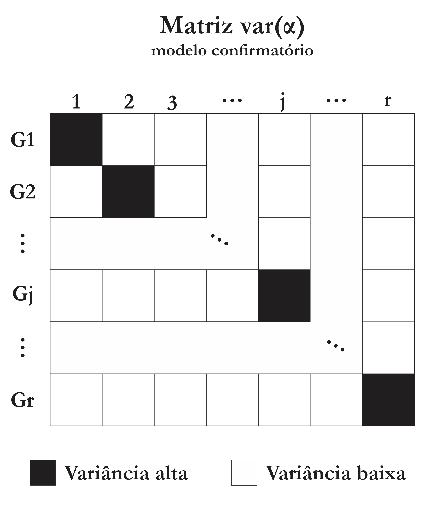
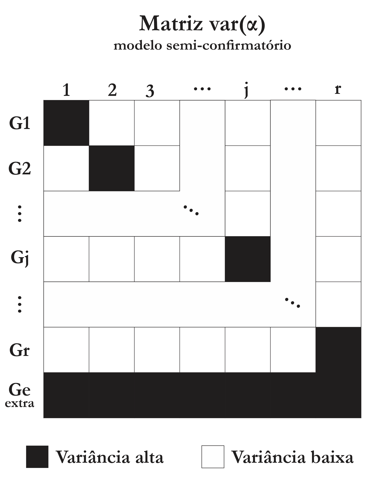
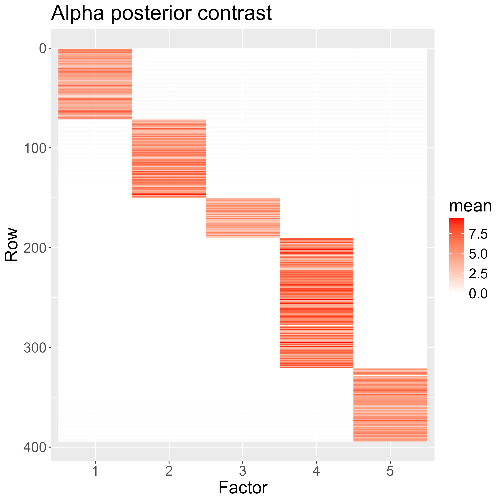
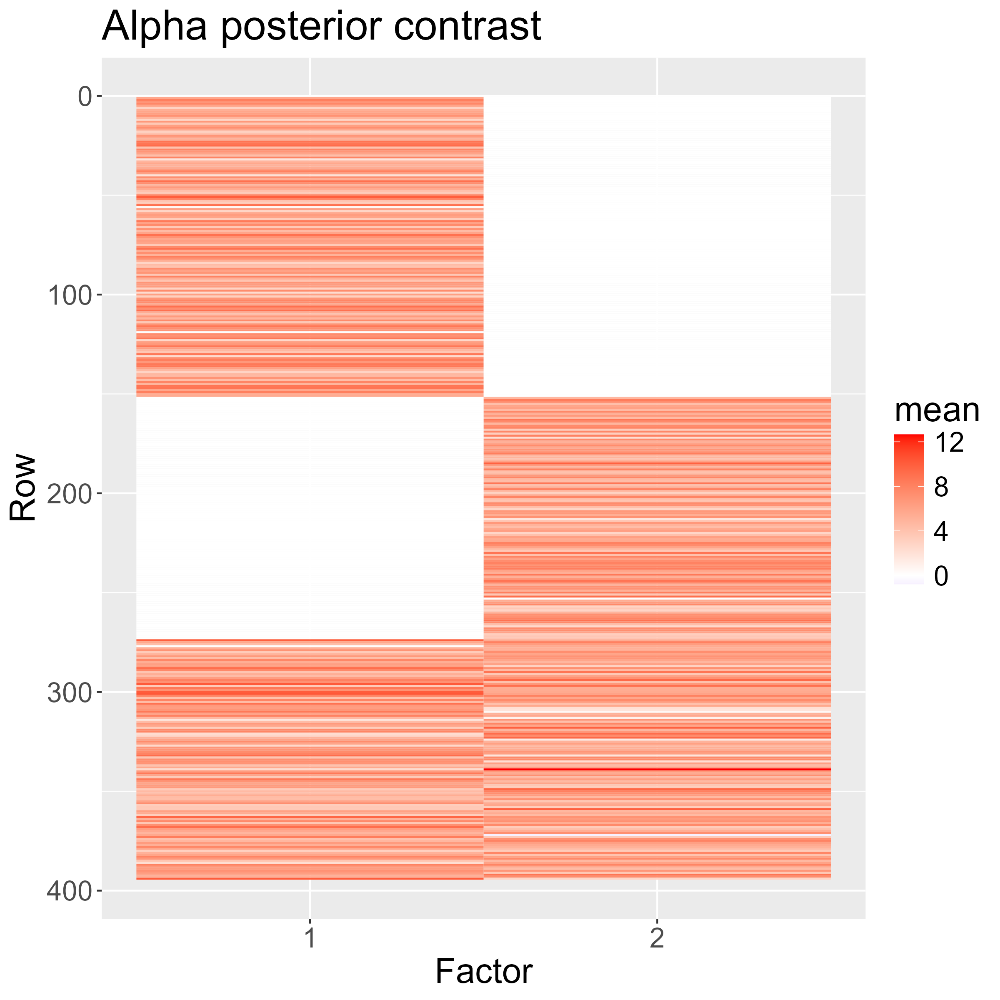

# Modelos básicos

## Análise fatorial exploratória

No modelo de análise fatorial com apenas um fator, assumimos que

$$X = \alpha \lambda + \epsilon$$
ou, equivalentemente,

$$X_{i,j}|\{\alpha, \lambda, \sigma^2\} \sim \text{Normal}(\alpha_i \lambda_j, \sigma_i^2),$$  

em que: 

* $X \in \mathbb R^{n \times m}$ é a matriz de observações;
* $\alpha \in \mathbb R^n$ é a matriz das cargas;
* $\lambda \in \mathbb R^m$ é a matriz de escores;
* $\epsilon \in \mathbb R^{n \times m}$ é a componente estocástica do modelo, em que assumimos que $\epsilon_{i,j} \sim N(0, \sigma^2_i)$ independentes e escrevemos $\sigma^2 = (\sigma^2_1, \dots, \sigma^2_n)'$.

::: {.callout-note}
Embora estejamos assumindo normalidade nos exemplos dessa seção, outras distribuições podem ser usadas para escrever a verossimilhança do nosso modelo. Nesse sentido (e analogamente aos MLGs), poderíamos ter algo do tipo

$$X_{i,j}|\{\alpha, \lambda, \sigma^2\} \sim FE\Bigr(\ g(\alpha_i \lambda_j), \ \phi_i\ \Bigr),$$

em que $FE$ é alguma distribuição da família exponencial, $\phi_i$ é um parâmetro de precisão/escala e $g$ uma função de ligação que faça sentido.

:::


### Identificabilidade {.unnumbered}

Assim como seu análogo frequentista, o modelo acima padece de falta de identificabilidade. Isso ocorre pois $\alpha\lambda = \alpha QQ^\top\lambda$ para qualquer $Q$ ortogonal. Um exemplo de como isso pode afetar a estimação da distribuição posterior é mostrado abaixo.

```stan
data {
  int n;
  vector[n] x;
  real mu_b;
}
parameters {
  real<lower=0> a;
  real b;
}
model {
  x ~ normal(a*b, 1);
  a ~ normal(0, 1);
  b ~ normal(mu_b, 1);
}
```


```{r}
#| eval: false
#| echo: false
mod = rstan::stan_model(model_code = "
data {
  int n;
  vector[n] x;
  real mu_b;
}
parameters {
  real<lower=0> a;
  real b;
}
model {
  x ~ normal(a*b, 1);
  a ~ normal(0, 1);
  b ~ normal(mu_b, 1);
}
")

saveRDS(mod, here::here("modIdent.rds"))
```


```{r}
#| layout-ncol: 2
#| code-fold: true
mod = readRDS(here::here("modIdent.rds"))

set.seed(12345)

x = rnorm(100, 1)

out = capture.output({
  rstan::sampling(mod, data = list(n = length(x), x = x, mu_b = 0), chains = 1, seed = 12345) |>
    rstan::extract(pars = c("a", "b"), permuted = FALSE) |>
    drop() |>
    plot(main = "posterior a partir de prioris iguais")
  })

out = capture.output({
  rstan::sampling(mod, data = list(n = length(x), x = x, mu_b = 100), chains = 1, seed = 12345) |>
    rstan::extract(pars = c("a", "b"), permuted = FALSE) |>
    drop() |>
    plot(main = "posterior a partir de prioris informativas")
  })
```

No simples exemplo acima não tivemos problema de convergência das cadeias


Embora o modelo descrito acima

::: {.callout-caution}
#### $a$ ou $-a$?

Embora seja possível haver dados com cargas positivos e negativas em um mesmo grupo, em modelos com dados longitudinais naturais. Isso está associado a uma espécie de relação suave entre as variáveis.

Lembre-se que uma carga positiva indica uma correlação positiva entre a variável e seu fator.
:::

Assim, assumimos as seguintes prioris,

$$
\alpha \sim N_n(0, V_\alpha),\\
$$
$$
\lambda \sim N_m(0, v_\lambda),\\
$$
$$
\sigma^2 \sim Gama_n(\epsilon, \epsilon),
$$
em que $v_\lambda << V_\alpha$ e $\epsilon$ é um número positivo pequeno, de modo a garantir falta de informação. 

### O papel da heterocedasticidade {.unnumbered}

A heterocedasticidade pode ser uma ferramenta valiosa para a avaliação da qualidade do ajuste do modelo. Na medida em que $\sigma_i$ é o desvio padrão de $X_{i,j}$ em relação a $\alpha_i\lambda_j$ (que é a média estimada levando em consideração todas as variáveis), interpretamos $\sigma_i$ como uma espécie de variância residual, uma variância dos dados não explicada pelo modelo de análise fatorial.


## Modelos confirmatório e semi-confirmatório

Caso desejemos adicionar mais de um fator ao nosso modelo, uma extensão natural do modelo confirmatório é feita com as seguintes alterações (considerando $r$ fatores).

* $\alpha \in \mathbb R^{n \times r}$ é a matriz das cargas;
* $\lambda \in \mathbb R ^{r \times m}$ é a matriz de escores.

Note também que, agora, a média da variável resposta é decomposta efeitos fatoriais ponderados pelas cargas.

$$
\begin{aligned}
\text{E}\bigr[{X_{i,j} \mid \alpha, \lambda, \sigma^2}\bigr] &= (\alpha\lambda)_{i,j} \\
&= \sum_{\delta=1}^r \alpha_{i,\delta}\lambda_{\delta,j} \\
&= \alpha_{i,1}\lambda_{1,j}
+ \dots
+ \alpha_{i,r}\lambda_{r,j}.
\end{aligned}
$$
Nesse sentido, as cargas têm uma dupla interpretação:

* nível de associação da variável com aquele fator;
* correção de escala, ajustar a escala do fator para a escala da variável resposta.

Ambas interpretações são apropriadas: uma carga mais alta não necessariamente significa uma maior associação entre variável e fator (pode decorrer de um ajuste de escala), mas uma carga baixa em valor absoluto significa necessariamente uma falta de associação entre eles.

### Criando grupos via prioris informativas {.unnumbered}

::: {layout-ncol=2}





:::

::: {.callout-note}
#### Um classificador fatorial

O modelo semi-confirmatório é (também) um modelo de classificação
:::


::: {layout-ncol=2}





Aplicação com dados de temperatura (modelo confirmatório por regiões do país, modelo semi-confirmatório por altitude)
:::

